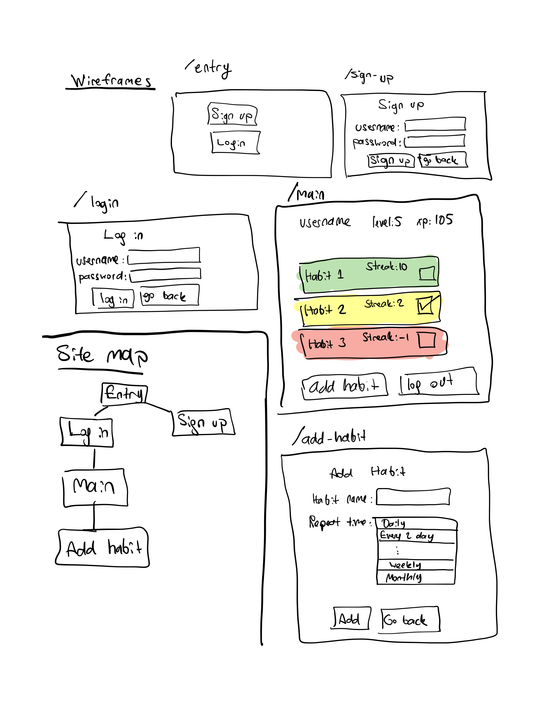

# 🚀 Gamified Habit Tracker with AI-Powered Features

 <!-- Replace with a suitable image -->

Track, gamify, and stay motivated with your habits! This habit tracker now leverages **Generative AI** for smarter habit suggestions, personalized motivation, and interactive gamified experiences.

## 🎯 Features Overview

| Feature | Description | Visual |
|---|---|---|
| 🎉 **AI-Driven Motivation** | Get personalized, inspiring messages based on your progress and goals. |  |
| ⏰ **Smart Reminders & Habit Suggestions** | Receive AI-suggested habits and automated reminders to stay on track. |  |
| 🏆 **Gamified Habit Progress** | Earn points, unlock achievements, and engage with fun challenges powered by AI. |  |

---

## 🧠 How It Works

This project integrates AI into the core of your habit-building process:

1. **Motivational Messages**: Generative AI provides real-time personalized messages to keep you focused.
2. **Smart Habit Suggestions**: The AI suggests new habits based on your current routine and progress.
3. **Reminders & Notifications**: The system sends timely reminders to complete your tasks.
4. **Gamification**: Reward yourself with points, badges, and AI-generated challenges that keep you engaged.

 <!-- Add a flowchart of the habit tracker system -->

---

## 🛠️ Installation & Setup

1. **Clone the Repository**:
   ```bash
   git clone https://github.com/yourusername/gamified-habit-tracker.git
   cd gamified-habit-tracker
   ```

2. **Install Dependencies**:
   ```bash
   pip install -r requirements.txt  # For Python projects
   npm install  # For JavaScript projects
   ```

3. **Set Up API Keys**:
   - Replace `your_api_key` in the `config.py` or `.env` file with your OpenAI key.

4. **Run the Project**:
   ```bash
   python app.py  # or npm start
   ```

---

## 🧩 Project Structure

```
gamified-habit-tracker/
│
├── ai/                      # AI-related code (e.g., GPT API integration)
│   └── motivation.py
│
├── static/                  # Static assets for the frontend
│   ├── images/
│   └── css/
│
├── templates/               # HTML files (if using Flask/Django)
│   └── index.html
│
├── main.py                  # Main app logic
├── README.md                # This file
├── requirements.txt         # Python dependencies
└── .env                     # API keys and environment variables
```

---

## 🌟 Screenshots

| Dashboard | AI Messages | Progress Gamification |
|---|---|---|
|  |  |  |

---

## 📈 Roadmap

- [x] AI-Generated Motivational Messages
- [x] Habit Suggestions and Reminders
- [x] Gamified Tracking System
- [ ] Mobile App Integration
- [ ] Social Sharing for Achievements

---

## 🤝 Contributing

1. Fork the repository.
2. Create a new branch (`git checkout -b feature-branch`).
3. Commit your changes (`git commit -m 'Add some feature'`).
4. Push to the branch (`git push origin feature-branch`).
5. Create a Pull Request.

---

## 📬 Contact

For any questions or feedback, feel free to reach out via (mailto:prithisingar@gmail.com).

---


## Overview

Note: This project was made for the Applied Internet Tecnologies course at NYU.

Games utilize various strategies to keep players interested about the game and motivated to pursue objectives presented in them. An interesting storyline, vaious bosses to fight, the level up and ability systems all aim to keep the player engaged. These mechanisms target our innate desire to see progress and provide a reliable sense of achievement.

One problem with habit formation is that the rewards of sticking to a habit often come so slowly that it is hard for our brains to notice the immediate impact of our actions. This makes it harder for our habits to stick. This app aims to implement strategies used in games on a habit tracker so the user is more likely to follow through their habits.

Users can register and login, they can add habits that they can check daily or weekly (or another time frame of their own choosing). Habits will change color based on how often they are checked. Each time a user checks their habit, they earn xp to level up.

## Data Model

The application will store Users and Habits.

* Users will have level and xp (both Numbers) by embedding
* Users can have multiple habits (via references)

The only way a user can gain xp is to complete habits, and gaining xp will increase their level over time.

An Example User:

```javascript
{
  username: "habitTrackerPlayer",
  hash: // a password hash,
  level: // an integer
  xp: // an integer
  habits: // an array of references to Habits
}
```

An Example Habit:

```javascript
{
  title: "Drink at least 2L water every day."
  streak: // integer
  repeat time: // an array of options as to how often this habit should be repeated (daily, every other day, weekly, monthly)
}
```

## [Mongoose Models](/models)

## Wireframes and Sitemap



## User Stories or Use Cases

1. as non-registered user, I can register a new account with the site
2. as a user, I can log in to the site
3. as a user, I can add a new habit
4. as a user, I can specify how often each habit should be checked
5. as a user, I can view all my habits in a single list
6. as a user, I can check off habits as done
7. as a user, I can level up by earning more xp
8. as a user, I can earn xp by checking off habits on time

## Research Topics

* (6 points) Front-end framework
    * I'm going to use Next.js for this project
* (2 points) ESLint
    * I'll integrate ESLint into my workflow
* (2 points) tailwind.css
    * I'll use tailwind.css

## [Main Project File](pages/main.js)

## Annotations / References Used
https://jwt.io/

https://vercel.com/docs/

https://docs.mongodb.com/

https://nextjs.org/docs

https://developer.mozilla.org/en-US/docs/Web/HTTP/Cookies

https://github.com/skolhustick/nextjs-mongoose-example/

https://github.com/vercel/next.js/tree/canary/examples/with-mongodb-mongoose/

